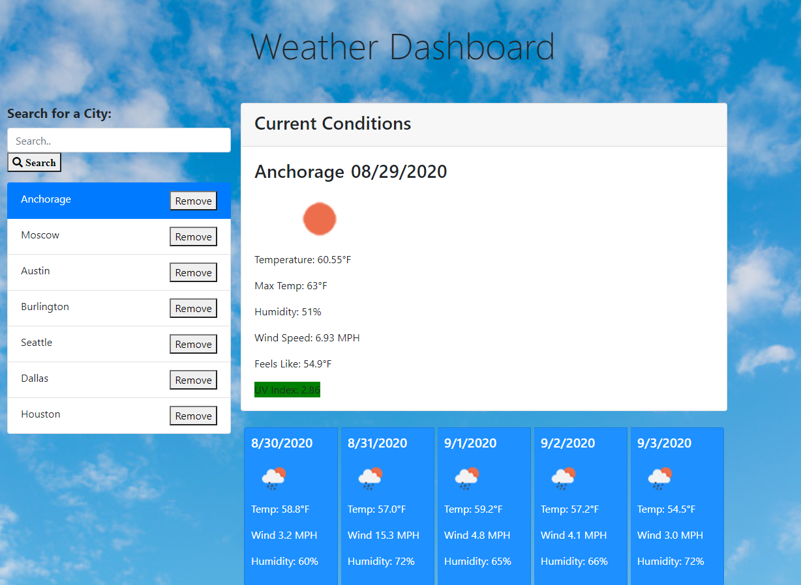
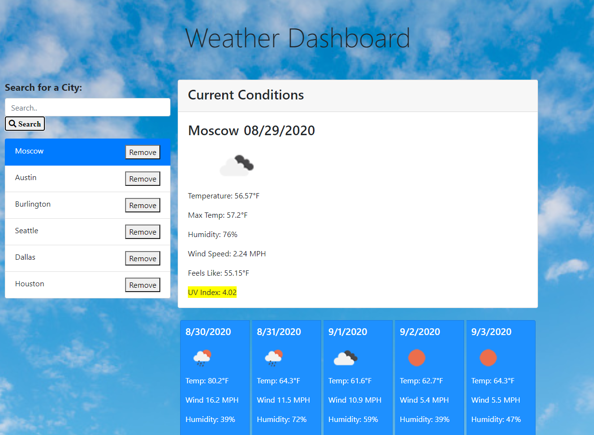
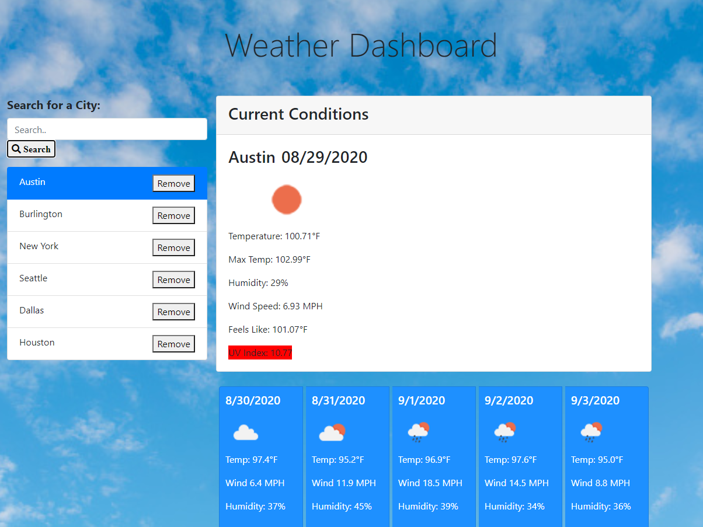
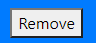
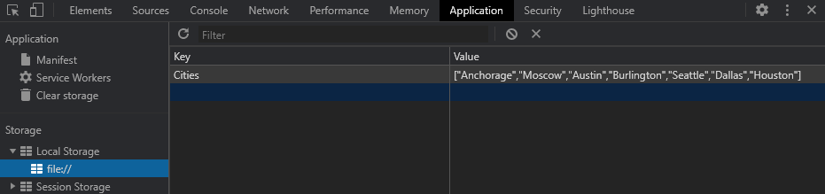

# ☀ [Weather_Forecast_Dashboard](https://cenzo-cmd.github.io/Weather_Forecast_Dashboard/) 🌦

"Sunshine is delicious, rain is refreshing, wind braces us up, snow is exhilarating; there is really no such thing as bad weather, only different kinds of good weather." 
~ John Ruskin

This dashboard was created to easily browse different cities and get the current day and 5 day weather forecast.  Upon opening the dashboard, there is a search bar on the left to enter a city.  When the city is entered, it will automatically pull information from [Open Weather API](https://openweathermap.org/api) and gives you a simplistic user interface with lots of content.  
 
Every time a city is searched, the cities will be generated into a list which is stored into local storage so if the page is refreshed, your recent searched cities will still be there.  The UV index displays 3 colors based on the severity of the index, Green - low, Yellow - mild, Red - high. 

Another featured that was added was the remove buttons on each city item.  When  is clicked, the city will automatically be removed from the list and local storage will be updated.   Local storage is saved as a stringified array with the cities as the value.

https://cenzo-cmd.github.io/Weather_Forecast_Dashboard/

