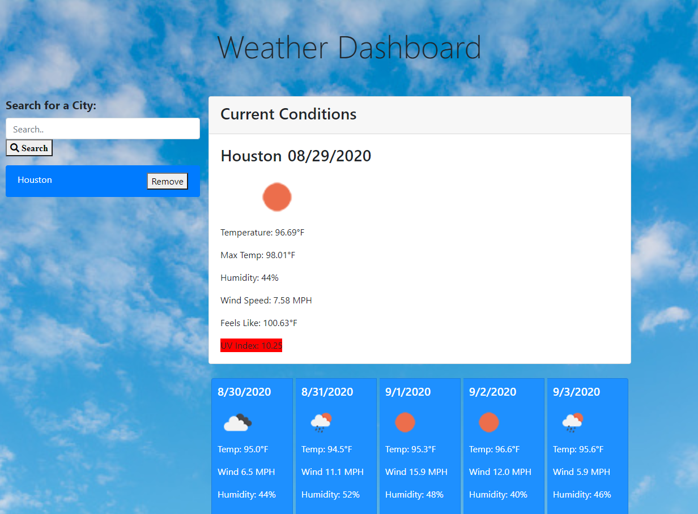

# ☀ [Weather_Forecast_Dashboard](https://cenzo-cmd.github.io/Weather_Forecast_Dashboard/) 🌦

"Sunshine is delicious, rain is refreshing, wind braces us up, snow is exhilarating; there is really no such thing as bad weather, only different kinds of good weather." 
~ John Ruskin

This dashboard was created to easily browse different cities and get the current day and 5 day weather forecast.  Upon opening the dashboard, there is a search bar on the left to enter a city.  When the city is entered, it will automaically pull information from [Open Weather API](https://openweathermap.org/api) and give you a simplitic user interface with lots of content.  

